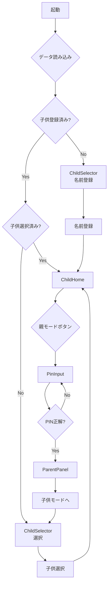

# 実装計画: 複数子供対応

**日時**: 2025年10月5日  
**要件**: 子供2名対応、名前登録機能、子供選択画面

---

## 📋 概要

### 現在の仕様
- 単一の子供の時間を管理
- データ構造: `{ remainingMinutes, startTimestamp }`

### 新しい仕様
- 最大2名の子供を管理
- 各子供に名前を設定可能
- 起動時に子供選択画面を表示
- データ構造: `{ children: [{ id, name, remainingMinutes, startTimestamp }], selectedChildId }`

---

## 🔄 移行戦略（アプローチ1: 段階的移行）

### マイグレーション方針
1. **既存データを保持**: 既存ユーザーのデータを「こども1」として自動登録
2. **自動変換**: IndexedDB version 1 → version 2 への自動アップグレード
3. **後方互換性**: 既存の履歴データにchildIdを自動付与

### データ移行フロー
```
旧データ (v1):
{
  pin: "0000",
  remainingMinutes: 5,
  startTimestamp: 0,
  version: 1
}

↓ マイグレーション

新データ (v2):
{
  pin: "0000",
  children: [
    {
      id: "child-1",
      name: "こども1",
      remainingMinutes: 5,
      startTimestamp: 0
    }
  ],
  selectedChildId: "child-1",
  version: 2
}
```

---

## 🏗️ 実装内容

### 1. 型定義の更新 ✅

**ファイル**: `src/types/index.ts`

**追加する型**:
```typescript
export interface Child {
  id: string;
  name: string;
  remainingMinutes: number;
  startTimestamp: number;
}

export interface AppState {
  pin: string;
  children: Child[];
  selectedChildId: string | null;
  version: number;
}

export interface UsageLog {
  id: string;
  childId: string; // 追加
  // ... 他のフィールド
}
```

---

### 2. StorageService の更新 ✅

**ファイル**: `src/services/storage.ts`

**実装内容**:
- IndexedDB version 2 への移行
- マイグレーション処理（v1 → v2）
- `getLogs(limit, childId?)` に childId パラメータ追加

**マイグレーションロジック**:
```typescript
this.version(2).stores({
  appState: '++id, version',
  usageLogs: 'id, childId, start, end, type'
}).upgrade(async (trans) => {
  const oldState = await trans.table('appState').get(1);
  if (oldState && !oldState.children) {
    // 旧データを新構造に変換
    const defaultChild = {
      id: 'child-1',
      name: 'こども1',
      remainingMinutes: oldState.remainingMinutes || 0,
      startTimestamp: oldState.startTimestamp || 0
    };
    
    const newState = {
      pin: oldState.pin,
      children: [defaultChild],
      selectedChildId: 'child-1',
      version: 2
    };
    
    await trans.table('appState').clear();
    await trans.table('appState').add({ ...newState, id: 1 });
    
    // 既存ログにchildIdを追加
    const logs = await trans.table('usageLogs').toArray();
    for (const log of logs) {
      if (!log.childId) {
        await trans.table('usageLogs').update(log.id, { childId: 'child-1' });
      }
    }
  }
});
```

---

### 3. appStore の更新 ⏳

**ファイル**: `src/stores/appStore.ts`

**追加する状態**:
```typescript
interface AppStore {
  // 既存
  pin: string;
  isParentMode: boolean;
  // ... 他のフィールド
  
  // 新規追加
  children: Child[];
  selectedChildId: string | null;
}
```

**追加するアクション**:
```typescript
// 子供管理
selectChild: (childId: string) => void;
addChild: (name: string) => Promise<void>;
updateChildName: (childId: string, name: string) => Promise<void>;

// 選択中の子供を取得するヘルパー
getSelectedChild: () => Child | null;
```

**更新が必要な既存アクション**:
```typescript
// 全て選択中の子供に対して操作するように変更
initialize: () => Promise<void>;
grantMinutes: (minutes: number) => Promise<void>;
startGame: () => Promise<boolean>;
stopGame: () => Promise<void>;
resetTime: () => Promise<void>;
```

---

### 4. 新規コンポーネント ✅

**ファイル**: `src/components/child/ChildSelector.tsx`

**機能**:
- 子供リスト表示（名前、残り時間）
- 子供選択
- 名前追加（最大2名）
- 名前編集
- 親モードボタン

**UI構成**:
```
┌─────────────────────────────┐
│  👶 だれの じかん？         │
│  なまえを えらんでね         │
├─────────────────────────────┤
│  ┌───────────────────────┐  │
│  │ こども1    5ぷん のこり│✏️│
│  └───────────────────────┘  │
│  ┌───────────────────────┐  │
│  │ こども2   10ぷん のこり│✏️│
│  └───────────────────────┘  │
│                             │
│  [➕ なまえを ついかする]    │
│                             │
│  親モード →                 │
└─────────────────────────────┘
```

---

### 5. 既存コンポーネントの更新 ⏳

#### 5.1 ChildHome.tsx
**変更内容**:
- 選択中の子供の情報を表示
- タイトルに子供の名前を追加: `{name}の ゲーム時間`
- 選択中の子供の remainingMinutes, startTimestamp を使用

#### 5.2 UsageHistory.tsx
**変更内容**:
- `StorageService.getLogs(10, selectedChildId)` で特定の子供の履歴のみ取得

#### 5.3 ParentPanel.tsx
**変更内容**:
- 子供選択UI を追加
- 選択中の子供に対して時間付与
- 各子供の状態を表示

---

### 6. App.tsx の更新 ⏳

**画面フロー**:
```
起動
 ↓
データ読み込み
 ↓
children.length === 0? ────Yes──→ ChildSelector（名前登録促す）
 ↓ No
selectedChildId === null? ──Yes──→ ChildSelector（選択促す）
 ↓ No
ChildHome（選択中の子供の画面）
```

**状態管理**:
```typescript
const { children, selectedChildId } = useAppStore();

// 画面判定
if (showPinInput) return <PinInput />;
if (isParentMode) return <ParentPanel />;
if (children.length === 0 || !selectedChildId) return <ChildSelector />;
return <ChildHome />;
```

---

## 🔄 画面遷移図



---

## 📝 実装手順

### Phase 1: 基盤整備 ✅
1. ✅ 型定義の更新
2. ✅ StorageService のマイグレーション実装
3. ✅ ChildSelector コンポーネント作成

### Phase 2: ストア更新 ⏳
4. appStore の状態追加
5. appStore のアクション追加
6. 既存アクションの更新

### Phase 3: コンポーネント更新 ⏳
7. ChildHome の更新
8. UsageHistory の更新
9. ParentPanel の更新

### Phase 4: 統合 ⏳
10. App.tsx のフロー更新
11. ビルド確認
12. 動作テスト

---

## ⚠️ 注意事項

### データ互換性
- 既存ユーザーは自動的に「こども1」として登録される
- 履歴データは保持され、「こども1」に紐付けられる
- PINは保持される

### 制限事項
- 子供は最大2名まで
- 名前は最大10文字
- 削除機能は今回は実装しない（将来の拡張として）

### テスト項目
1. **新規ユーザー**:
   - 子供登録画面が表示される
   - 名前を登録できる
   - 2名まで登録できる

2. **既存ユーザー（マイグレーション）**:
   - データが「こども1」として移行される
   - 残り時間が保持される
   - 履歴が保持される
   - PINが保持される

3. **子供選択**:
   - 複数の子供から選択できる
   - 選択した子供の画面が表示される
   - 切り替えができる

4. **名前編集**:
   - 名前を変更できる
   - 変更が保存される

---

## 🎯 期待される動作

### シナリオ1: 新規ユーザー
1. アプリ起動
2. 「なまえを ついかする」画面表示
3. 「たろう」と入力して登録
4. 「たろうの ゲーム時間」画面表示
5. 親が「+5分」付与
6. 戻るボタンで子供選択画面へ
7. 「➕ なまえを ついかする」で「はなこ」追加
8. 「はなこ」を選択
9. 「はなこの ゲーム時間」画面表示

### シナリオ2: 既存ユーザー
1. アプリ起動（既存データあり: 残り5分）
2. マイグレーション自動実行
3. 「こども1」として登録済み
4. 子供選択画面表示
5. 「こども1（5ぷん のこり）」が表示される
6. 選択すると従来通り使用できる
7. 名前を「たろう」に変更可能

---

## 📊 実装規模

### 変更ファイル
- ✅ 型定義: `src/types/index.ts`
- ✅ ストレージ: `src/services/storage.ts`
- ✅ 新規コンポーネント: `src/components/child/ChildSelector.tsx`
- ⏳ ストア: `src/stores/appStore.ts`（大幅更新）
- ⏳ コンポーネント: `ChildHome.tsx`, `UsageHistory.tsx`, `ParentPanel.tsx`
- ⏳ アプリ: `src/App.tsx`

### 推定作業時間
- Phase 1（基盤整備）: ✅ 完了
- Phase 2（ストア更新）: 30分
- Phase 3（コンポーネント更新）: 30分
- Phase 4（統合・テスト）: 20分
- **合計**: 約1.5時間

---

これから Phase 2 以降の実装を進めます。
