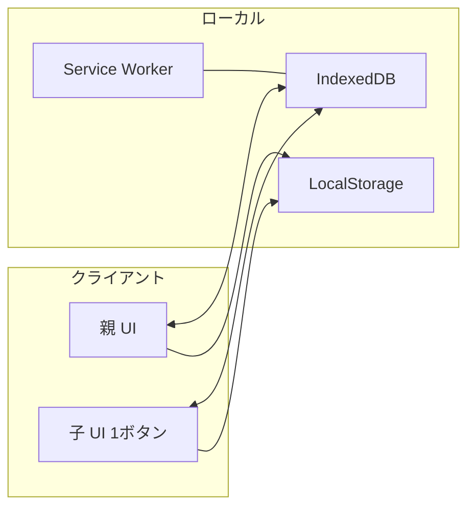
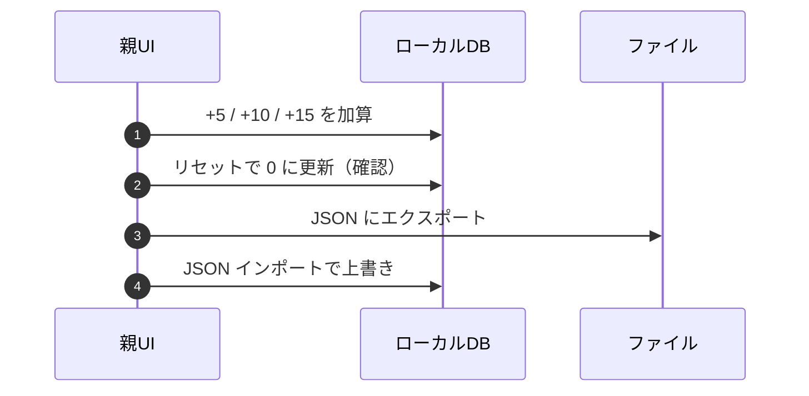
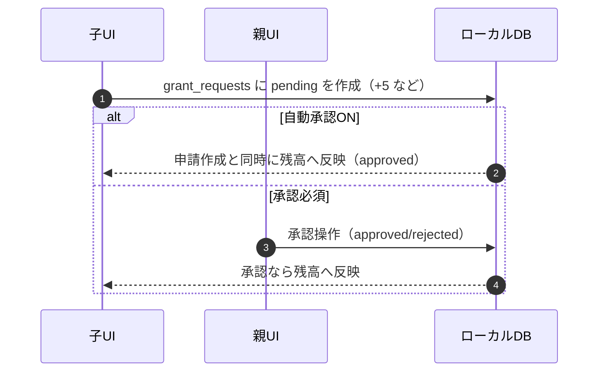
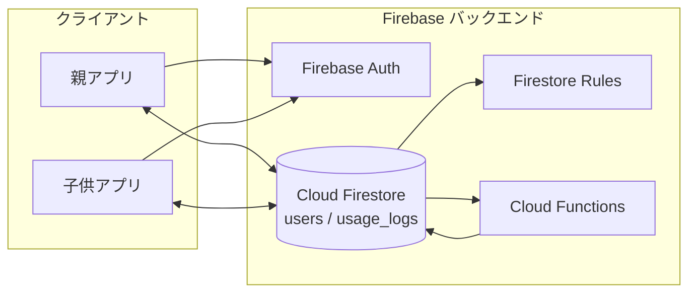

## 🧭 アーキテクチャ図（Architecture Overview）

要件定義書・概要設計書の内容を踏まえたシステム全体像です。まずは MVP（ローカル/PWA、ログインなし）の構成を示し、将来の Firebase 連携構成も併記します。

### 1. MVP ローカル構成図（PWA）



---

### 2. MVP シーケンス図（ローカル）

#### A. 子: 開始と終了（ローカル計測）

```mermaid
sequenceDiagram
  autonumber
  participant C as 子UI
  participant IDB as ローカルDB
  participant LS as 設定

  Note over C: 残りが0分なら開始不可

  C->>IDB: startTimestamp を保存
  C-->>C: 画面に経過を表示
  ... 経過 ...
  C->>IDB: end で startTimestamp を読み込み
  C-->>C: 経過分を分に丸めて減算
  C->>IDB: remainingMinutes を更新
  C-->>C: 残り時間を再表示
```

#### B. 親: 付与・リセット・バックアップ



#### C. 子: 追加時間の申請と承認



---

### 3. MVP セキュリティと整合性

- 親モードは PIN ロック、複数回失敗でクールダウン（任意）
- 子の終了操作は長押しまたは確認で誤操作防止
- 連続セッション最大長で暴走防止、1分単位で丸め
- iPad Safari 運用: プライベートブラウズ回避、PWAとSafariはどちらかに統一
- データ保全: 定期JSONバックアップを推奨

---

### 4. 将来構成図（Firebase 連携）



### 5. 将来: クラウド連携の考慮

- 認証と権限制御: 親子ロールを区別
- 同期と一貫性: Functions で時間加減算を集中管理
- セキュリティ: Rules で不正書き込みを防止、型と範囲を検証
