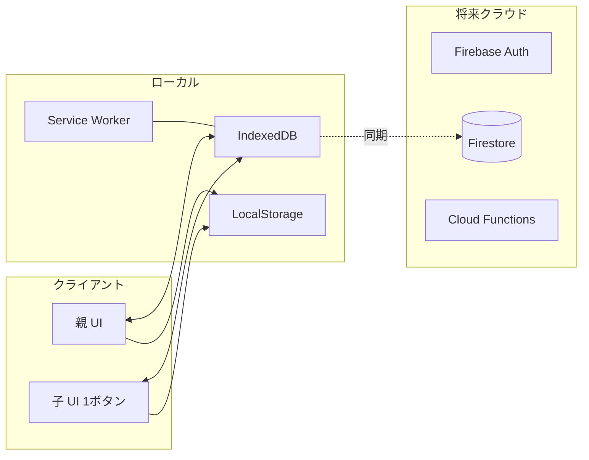

## 🏗️ 概要設計書（High-Level Design）

### 0. MVP 方針（最小工数）

- タスク管理は行わず、合意したトータル時間の付与・消費のみ
- プラットフォーム: Web / PWA（ログインなし、家庭内利用）
- データ: 端末ローカル保存（IndexedDB / LocalStorage）、JSON バックアップ
- 子 UX: 残り時間表示 + トグル 1 ボタン（開始/終了）またはプリセット消費
- 子の追加時間は「申請」→ 親承認で反映（設定で自動承認可）
- 親 UX: 時間付与プリセット、リセット、PIN ロック
- 将来拡張: Firebase（Auth / Firestore / Functions）、学習計画機能

---

### 1-A. システム構成図（MVP ローカル/PWA）



 

### 1-B. システム構成図（将来/クラウド連携）

```mermaid
flowchart TD
  subgraph 親デバイス
    P1[親アプリUI]
    P2[Firebase Auth]
    P3[申請管理画面]
    P4[時間操作画面]
  end

  subgraph 子供デバイス
    C1[子供アプリUI]
    C2[残り時間表示]
    C3[ゲーム時間スタート/ストップ]
    C4[追加申請送信]
  end

  subgraph Firebase（バックエンド）
    DB[Firestore DB]
    AUTH[認証]
    FUNC[Cloud Functions]
  end

  P1 --> P2 --> AUTH
  C1 --> P2
  P1 --> P3 --> DB
  P1 --> P4 --> DB
  C1 --> C2 --> DB
  C1 --> C3 --> DB
  C1 --> C4 --> DB
  DB <--> FUNC
```

---

 

### 2-A. データ構造（ローカル）

#### appState（単一レコード想定）

```json
{
  "pin": "1234",
  "remainingMinutes": 45,
  "startTimestamp": 0,
  "version": 1
}
```

#### usage_logs（任意・履歴）

```json
{
  "id": "u1",
  "start": 1730826000000,  // セッション開始（ms）
  "end": 1730827200000,    // セッション終了（ms）
  "duration": 20           // 分（丸め後）
}
```

#### grant_requests（子の追加申請）

```json
{
  "id": "g1",
  "minutes": 10,                  // 申請分
  "createdAt": 1730827000000,     // ms
  "status": "pending|approved|rejected"
}
```

---

### 2. データ構造（Firestore）

将来のクラウド同期時の想定（タスクは扱わず、トータル時間・セッション・申請を管理）。

#### users

```json
{
  "uid": "xxxxx",
  "role": "parent | child",
  "name": "たろう",
  "gameMinutes": 45,
  "autoApprove": true
}
```

#### usage_logs（セッション履歴）

```json
{
  "userId": "xxxxx",
  "start": "2025-10-05T17:00:00Z",
  "end": "2025-10-05T17:20:00Z",
  "duration": 20
}
```

#### grant_requests（追加時間申請）

```json
{
  "requestId": "g1",
  "userId": "xxxxx",
  "minutes": 30,
  "status": "pending | approved | rejected",
  "createdAt": "2025-10-05T17:05:00Z",
  "approvedAt": "2025-10-05T17:06:00Z"
}
```

---

### 3. UIイメージ（概要）

#### 子供用（MVP）

* ホーム画面：残り時間の大きな表示
* 操作：開始/終了トグル 1 ボタン、または消費プリセット
* 追加時間の申請ボタン（+5/+10/+15/+30/+60、任意入力）

#### 親用（MVP）

* 付与：+5/+10/+15 分のプリセット
* リセット：確認付き
* PIN ロック：親モード切替
* 申請一覧：pending の承認/却下（自動承認設定のトグル）

---

### 3-A. 時間計測ロジック（MVP）

- 方式: 開始時に `startTimestamp` を保存、終了時に `now - startTimestamp` で消費計算
- 端数/丸め: 1 分単位で丸め、負残高は 0 で止める
- 制限: 連続セッションの最大長（例: 120 分）で暴走防止
- 復元: アプリ終了/再起動後も開始状態を検知し、終了時に精算
- ログ: 開始時に仮レコード作成、終了時に `end` と `duration` を確定

### 3-B. 追加申請ロジック（MVP）

- 子: 申請作成（`grant_requests` に `pending` で保存）
- 設定A（承認必須）: 親が承認 → `remainingMinutes += minutes`、`status=approved`
- 設定B（自動承認）: 申請作成と同時に残高反映、`status=approved`
- 却下: `status=rejected`（履歴として保持、残高は変化なし）

---

### 5. iPad Safari ローカルDB運用ガイド（MVP）

- ストレージ方針
  - 主ストアは `IndexedDB`。設定フラグ等のみ `LocalStorage` を使用。
  - データは必要最小限（`appState` と軽量な `usage_logs`）。古いログは任意でローテーション。
- Safari/iPadOS の注意
  - プライベートブラウズは避ける（永続化が制限される場合あり）。通常モードで運用。
  - PWA（ホーム画面追加）とSafariタブはストレージが別扱い。どちらかに統一して利用。
  - 端末ストレージ逼迫時にWebデータが整理される可能性。バックアップを定期実施。
- PWA 運用
  - Service Worker で静的資産をキャッシュ（オフライン可）。
  - PWAのアンインストールでデータは削除されるため、事前にバックアップ必須。
- バックアップ方針
  - 親パネルからJSONエクスポート/インポートを提供。
  - 推奨: 月1回、または大きな変更後にエクスポート。`game-time-backup_YYYY-MM-DD.json` で保存。
  - 保存先は「ファイル」アプリ（iCloud Drive 等）を推奨。
- タイマー実装の勘所
  - 常時カウントは行わず、`startTimestamp` を保存→終了時に経過再計算。
  - 連続最大長（例:120分）で暴走防止。残り0分なら開始不可。

---

### 4. 音声連携（将来構想）

* Alexaスキル or Google Assistant連携

  * 子供「今日のゲーム時間は？」→ アプリのDBを音声で返答
  * 親「時間追加して」→ Firebase Cloud Function 経由でDB更新

---

必要に応じて以下の資料も追加でご用意できます：

* 詳細設計書（画面遷移図、コンポーネント設計など）
* テスト仕様書
* Firebase初期構成セットアップ手順
* デプロイCI/CD構成（FlutterFlowやGitHub Actionsなど）

ご希望があれば続きます。どこから着手しましょうか？
