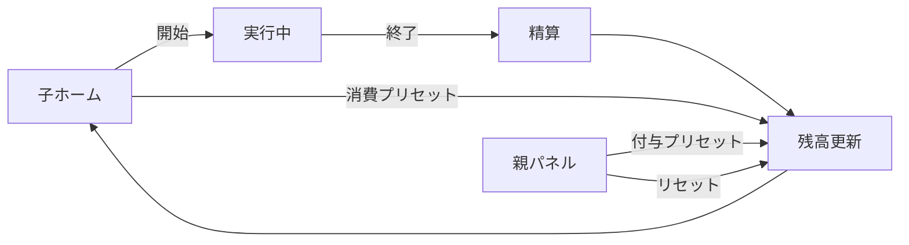
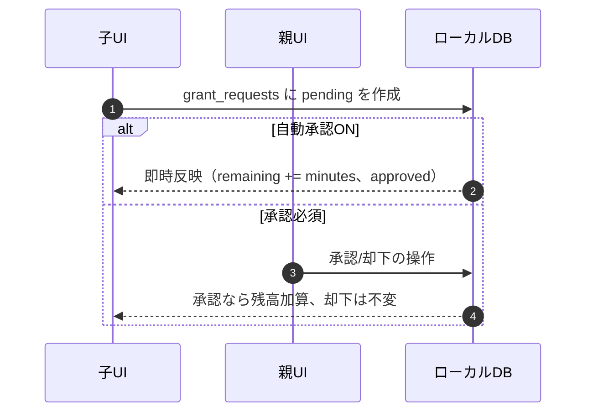
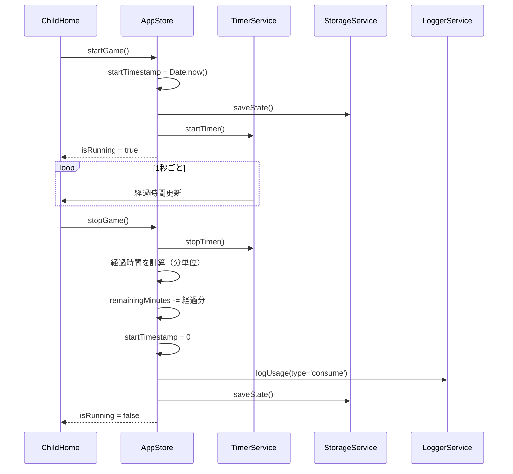
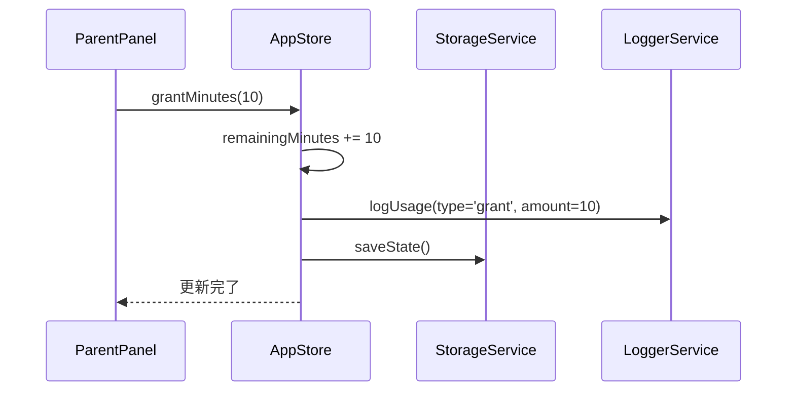
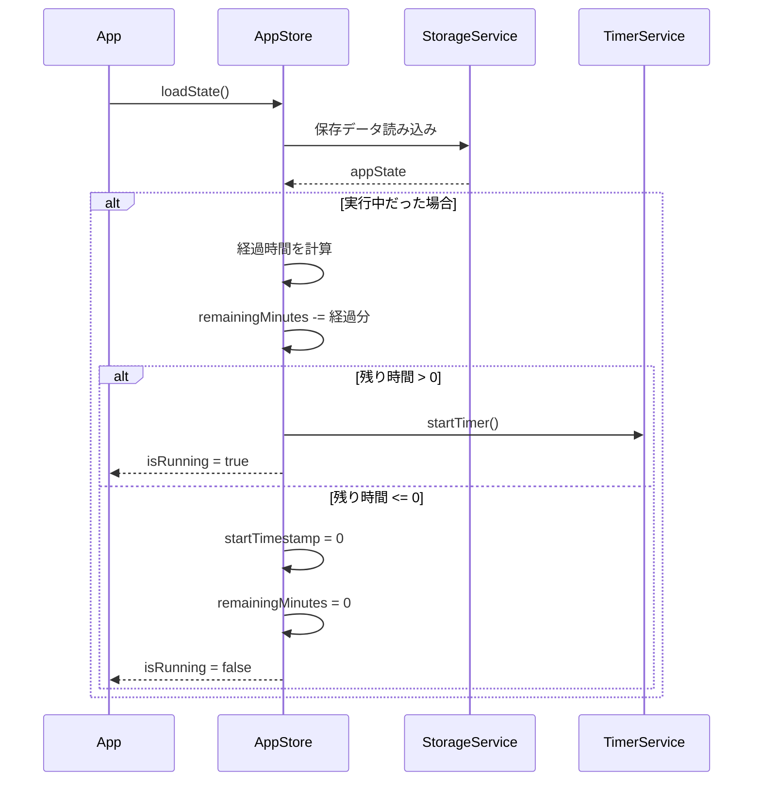

## 🧩 詳細設計書（MVP：合意時間のトータル管理）

MVP は「合意したゲーム時間」のトータル残高のみを管理します。タスク管理は対象外。親が時間を付与し、子は自己申告で消費します。

### 対象デバイス・環境

- **プライマリ**: iPad Safari（ブラウザ / PWA）
- **セカンダリ**: iPhone Safari、Android Chrome
- **運用方式**: ローカルストレージ（IndexedDB 主体）、定期的な JSON バックアップ

---

### 1. 画面・ナビゲーション構成

- 子ホーム
  - 残り時間の大きな表示（画面幅の60〜80%で大きなボタン）
  - 操作: 開始/終了トグル 1 ボタン（長押しで終了確認）
  - 状態: 実行中は経過時間の目安表示、残り 0 分なら開始不可
  - PINボタンで親モードへ切替
  - 追加申請: +5/+10/+15/+30/+60 分のプリセット、任意分入力→申請
- 親パネル（PIN ロック）
  - PIN入力画面（4桁）
  - 付与プリセット: +5/+10/+15 分
  - リセット: 0 分にする（確認ダイアログ）
  - バックアップ: JSON エクスポート/インポート
  - 追加申請一覧: pending を承認/却下、自動承認トグル
  - 子モードへ戻るボタン

---

### 2. データモデル（ローカル）

#### `appState`（単一レコード）

```
pin: string              // 親パネルの4桁PIN
remainingMinutes: number // 残り分
startTimestamp: number   // 実行中なら Epoch ms、未実行なら 0
autoApprove: boolean     // 追加申請の自動承認フラグ
version: number          // データスキーマ版
```

#### `usage_logs`（履歴）

```
id: string
start: number    // Epoch ms（開始）
end: number      // Epoch ms（終了）
duration: number // 分（丸め後）
type: 'consume' | 'grant'
amount?: number  // 分（grant のとき +、consume のとき -）
note?: string
```

---

#### `grant_requests`（子の追加申請）

```
id: string
minutes: number      // 申請分（最小1、推奨上限120）
status: 'pending' | 'approved' | 'rejected'
createdAt: number    // Epoch ms
approvedAt?: number  // Epoch ms（approved のとき）
```

---

### 3. 業務ロジック

- 付与（親）
  - 入力: `+5/+10/+15`（プリセット）
  - 処理: `remainingMinutes += preset`
  - ログ: `usage_logs` に `type='grant', amount=+N`
  - フィードバック: トースト通知「+10分 付与しました」
- 消費（子）
  - 方式: トグル（1ボタン）
    - 開始: `startTimestamp = now()`、ストレージに即座に保存
    - 終了: 長押しで確認ダイアログ表示→確定後に `delta = now() - startTimestamp` を分換算して丸め
    - 精算: `remainingMinutes = max(0, remainingMinutes - delta)`、`startTimestamp=0`
    - ログ: `usage_logs` に `type='consume', duration=delta, start, end`
    - ガード: `連続最大長=120分` を超える場合は `delta=120` として精算、警告表示
  - 復元: アプリ再起動時に `startTimestamp != 0` なら実行中状態を復元、経過時間を表示

- 追加申請（子→親）
  - 作成: 子がプリセット（+5/+10/+15/+30/+60）または任意分で申請を作成（`grant_requests` に `pending`）
  - 自動承認ON: 申請時に即時 `remainingMinutes += minutes`、`approvedAt` 記録
  - 承認必須: 親パネルの一覧で承認/却下。承認時に残高加算、却下時は不変

---

### 4. バリデーション/UXガード

- 残り 0 分時の開始禁止、理由を明示表示「残り時間がありません」
- 終了操作は長押し（0.5〜1秒）で確認ダイアログ表示
- PIN 入力は 連続 5 回失敗で 30 秒ロック（任意実装）
- 時刻は端末時計依存。将来はサーバ時刻に切替可
- ボタンサイズ: 画面幅の60〜80%、誤タップ防止の余白確保
- 申請の分数ガード: 最小1分、最大120分（任意）

---

### 5. PWA/ストレージ（iPad Safari 対応）

#### 5.1 ストレージ戦略

- **主ストア**: IndexedDB（`appState`、`usage_logs`）
- **補助**: LocalStorage（設定フラグ等の軽量データのみ）
- **データ量**: 必要最小限、古いログは任意でローテーション（例: 直近100件のみ保持）

#### 5.2 Safari/iPadOS の注意事項

- **プライベートブラウズ禁止**: 永続化が制限されるため、通常モードで運用
- **PWA vs Safari タブ**: ストレージが別扱いのため、どちらかに統一して利用
  - 推奨: ホーム画面に追加（PWA）として運用
- **ストレージ削除リスク**: 端末ストレージ逼迫時に Web データが整理される可能性あり
  - 対策: 定期的なバックアップを必須化
- **PWA アンインストール**: データも削除されるため、事前バックアップ必須

#### 5.3 バックアップ運用

- **エクスポート**: 親パネルから JSON ファイルとして保存
  - ファイル名形式: `game-time-backup_YYYY-MM-DD.json`
  - 推奨頻度: 月1回、または大きな変更後
  - 保存先: iCloud Drive（「ファイル」アプリ経由）
- **インポート**: JSON ファイル選択→上書き確認→復元
  - バリデーション: スキーマバージョンチェック、データ整合性確認

#### 5.4 Service Worker

- **キャッシュ戦略**: Cache First（静的アセット）
- **オフライン対応**: 完全オフライン動作可能
- **更新通知**: 新バージョン検出時に再読み込みプロンプト表示

---

### 6. 受け入れ基準（再掲）

- 子画面で開始→終了で残り時間が正しく減少する
- アプリ再起動後も開始状態を復元し、終了時に精算される
- 親パネルのプリセット付与が残高に反映される
- リセット操作で 0 分になる（確認あり）
 - 開始/終了時刻が usage_logs に記録される（start/end/duration）
 - 子の追加申請が作成でき、親は承認/却下できる（自動承認ONなら即時反映）

---

### 7. 簡易フロー図



#### 追加申請フロー（MVP / ローカル）



---

### 8. 画面設計（ワイヤーフレーム）

#### 8.1 子供用画面

##### 子ホーム画面（待機中）- iPad Safari想定
```
┌──────────────────────────── iPad Safari ────────────────────────────┐
│  残り時間                                                             │
│                                                                      │
│                         1 時間 30 分                                  │
│                                                                      │
│                                                                      │
│                         [ ゲームをはじめる ]                          │
│                    （画面幅の60〜80%、大きく表示）                     │
│                                                                      │
│  状態: 待機中                                                         │
│                                                                      │
│                                                      [親モード] →     │
└──────────────────────────────────────────────────────────────────────┘
```

**ポイント**:
- ボタンは画面幅の60〜80%で大きく、誤タップ防止の余白を確保
- 残り0分ならボタンは無効化（グレーアウト）し、理由「残り時間がありません」を表示

##### 子ホーム画面（実行中）- iPad Safari想定
```
┌──────────────────────────── iPad Safari ────────────────────────────┐
│  残り時間                                                             │
│                                                                      │
│                         1 時間 12 分                                  │
│                                                                      │
│                    経過: 00:18:24  （目安表示）                       │
│                                                                      │
│                         [ 長押しで終了する ]                          │
│                                                                      │
│  状態: 実行中（開始: 19:02）                                          │
│                                                                      │
│                                                      [親モード] →     │
└──────────────────────────────────────────────────────────────────────┘
```

**ポイント**:
- 終了は長押し（0.5〜1秒）で確認ダイアログ表示、誤操作防止
- 経過時間は目安表示。正確な計算は `開始時刻→終了時刻` の差分で行う
- バックグラウンド復帰時も経過時間を正しく表示

##### 子ホーム画面（時間切れ）- iPad Safari想定
```
┌──────────────────────────── iPad Safari ────────────────────────────┐
│  残り時間                                                             │
│                                                                      │
│                            0 分                                       │
│                                                                      │
│                                                                      │
│                   残り時間がありません                                │
│                   親に相談してください                                │
│                                                                      │
│  状態: 待機中                                                         │
│                                                                      │
│                                                      [親モード] →     │
└──────────────────────────────────────────────────────────────────────┘
```

#### 8.2 親用画面

##### PIN入力画面 - iPad Safari想定
```
┌──────────────────────────── iPad Safari ────────────────────────────┐
│  親モード                                                             │
│                                                                      │
│                     PIN を入力してください                            │
│                       [ ＿  ＿  ＿  ＿ ]                              │
│                                                                      │
│                              [ 開く ]                                 │
│                                                                      │
│                          [キャンセル]                                 │
│                                                                      │
└──────────────────────────────────────────────────────────────────────┘
```

**補足**:
- テンキーは iOS 標準の `type="number"` または `inputmode="numeric"` で表示
- 連続5回失敗で30秒ロック（任意実装）

##### 親管理画面（解錠後）- iPad Safari想定
```
┌──────────────────────────── iPad Safari ────────────────────────────┐
│  親モード                                                             │
│                                                                      │
│  残り時間: 1 時間 12 分                                              │
│                                                                      │
│  付与（プリセット）:   [ +5分 ]   [ +10分 ]   [ +15分 ]               │
│                                                                      │
│  リセット:            [ 0分にする ]  （確認ダイアログあり）            │
│                                                                      │
│  バックアップ:        [ エクスポート ]  [ インポート ]                 │
│                                                                      │
│                                                                      │
│                                                    [子供モードへ] →   │
└──────────────────────────────────────────────────────────────────────┘
```

**補足**:
- 付与/リセットは即時反映
- 操作時にトースト通知表示（例: 「+10分 付与しました」）
- バックアップは JSON ファイル、インポート時は上書き確認表示

##### データ管理画面（バックアップ）- iPad Safari想定
```
┌──────────────────────────── iPad Safari ────────────────────────────┐
│  ← 親モード                                            データ管理     │
│                                                                      │
│  バックアップ                                                         │
│  ┌─────────────────────────────────────────┐                        │
│  │  [ JSONファイルで保存 ]                  │                        │
│  │  推奨: 月1回、または大きな変更後         │                        │
│  │  保存先: iCloud Drive（ファイルアプリ） │                        │
│  └─────────────────────────────────────────┘                        │
│                                                                      │
│  復元                                                                 │
│  ┌─────────────────────────────────────────┐                        │
│  │  [ JSONファイルから読込 ]                │                        │
│  │  ⚠ 現在のデータは上書きされます         │                        │
│  └─────────────────────────────────────────┘                        │
│                                                                      │
│  最終保存: 2025/10/5 17:30                                           │
│  ファイル名: game-time-backup_2025-10-05.json                        │
│                                                                      │
└──────────────────────────────────────────────────────────────────────┘
```

---

### 9. コンポーネント設計（Web/PWA）

#### 9.1 技術スタック

- **フレームワーク**: React 18+ with TypeScript
- **状態管理**: Zustand または Context API
- **UI**: TailwindCSS + Headless UI
- **ストレージ**: IndexedDB (Dexie.js) または LocalStorage
- **PWA**: Vite PWA Plugin
- **ビルド**: Vite

#### 9.2 ディレクトリ構成

```
src/
├── App.tsx
├── main.tsx
├── vite-env.d.ts
├── components/
│   ├── child/
│   │   ├── ChildHome.tsx
│   │   ├── RemainingTimeDisplay.tsx
│   │   ├── GameTimer.tsx
│   │   └── PresetButtons.tsx
│   ├── parent/
│   │   ├── PinInput.tsx
│   │   ├── ParentPanel.tsx
│   │   ├── TimeManagement.tsx
│   │   ├── DataManagement.tsx
│   │   └── PinSettings.tsx
│   └── common/
│       ├── Button.tsx
│       ├── Dialog.tsx
│       └── Layout.tsx
├── stores/
│   └── appStore.ts
├── services/
│   ├── storage.ts
│   ├── timer.ts
│   └── logger.ts
├── types/
│   └── index.ts
└── utils/
    ├── time.ts
    └── validation.ts
```

#### 9.3 状態管理（Zustand）

```typescript
// stores/appStore.ts
interface AppState {
  // Data
  pin: string;
  remainingMinutes: number;
  startTimestamp: number; // 0 = not running
  version: number;

  // UI State
  isParentMode: boolean;
  isRunning: boolean;

  // Actions
  setPin: (pin: string) => void;
  grantMinutes: (minutes: number) => void;
  consumeMinutes: (minutes: number) => void;
  startGame: () => void;
  stopGame: () => void;
  resetTime: () => void;
  enterParentMode: (pin: string) => boolean;
  exitParentMode: () => void;

  // Persistence
  saveState: () => Promise<void>;
  loadState: () => Promise<void>;
  exportData: () => string;
  importData: (json: string) => boolean;
}
```

#### 9.4 主要コンポーネント仕様

##### ChildHome.tsx
- **Props**: なし
- **State**: `isRunning`, `remainingMinutes`, `elapsedTime`
- **機能**:
  - 残り時間の大きな表示
  - 開始/終了ボタン（状態によって切り替え）
  - 消費プリセットボタン（-5/-10/-15）
  - 親モードへの切り替えボタン

##### GameTimer.tsx
- **Props**: `startTimestamp: number`, `onStop: () => void`
- **State**: `elapsedSeconds: number`
- **機能**:
  - 1秒ごとに経過時間を更新
  - 残り時間をリアルタイム計算
  - 長押しで終了確認
  - 120分超過時の自動停止

##### ParentPanel.tsx
- **Props**: なし
- **State**: `editingMinutes: number`
- **機能**:
  - 付与プリセットボタン（+5/+10/+15）
  - 直接編集フォーム
  - リセットボタン（確認ダイアログ）
  - PIN変更・データ管理への遷移
  - 子供モードへの切り替え

##### PinInput.tsx
- **Props**: `onSuccess: () => void`, `onCancel: () => void`
- **State**: `pin: string[]`, `error: boolean`
- **機能**:
  - 4桁PIN入力UI
  - テンキー表示
  - バックスペース対応
  - 5回失敗で30秒ロック（任意）

---

### 10. データフロー設計

#### 10.1 ゲーム開始→終了のフロー



#### 10.2 時間付与のフロー



#### 10.3 アプリ起動時の復元フロー



---

### 11. API設計（ローカル関数）

#### 11.1 StorageService

```typescript
interface StorageService {
  // 保存・読み込み
  save(state: AppState): Promise<void>;
  load(): Promise<AppState | null>;

  // ログ管理
  addLog(log: UsageLog): Promise<void>;
  getLogs(limit?: number): Promise<UsageLog[]>;

  // バックアップ
  export(): Promise<string>; // JSON文字列
  import(json: string): Promise<boolean>;
}
```

#### 11.2 TimerService

```typescript
interface TimerService {
  start(callback: (elapsedSeconds: number) => void): void;
  stop(): number; // 経過秒数を返す
  getElapsed(): number; // 現在の経過秒数
  isRunning(): boolean;
}
```

#### 11.3 LoggerService

```typescript
interface LoggerService {
  logGrant(amount: number, note?: string): Promise<void>;
  logConsume(duration: number, note?: string): Promise<void>;
  getRecentLogs(limit: number): Promise<UsageLog[]>;
}
```

---

### 12. バリデーション・エラーハンドリング

#### 12.1 バリデーションルール

| 項目             | ルール                     | エラーメッセージ              |
| -------------- | ----------------------- | --------------------- |
| PIN            | 4桁の数字                   | 「4桁の数字を入力してください」    |
| 付与時間           | 1〜999分                  | 「1〜999分の範囲で入力してください」 |
| 直接編集           | 0〜999分                  | 「0〜999分の範囲で入力してください」 |
| ゲーム開始          | remainingMinutes > 0    | 「時間がありません」            |
| 連続ゲーム時間        | 最大120分                  | 「最大2時間で自動終了します」      |
| データインポート       | 有効なJSON、バージョン互換         | 「データ形式が正しくありません」     |
| PIN変更（新PIN確認） | 2回入力が一致                 | 「PINが一致しません」          |

#### 12.2 エラー処理方針

- **データ読み込みエラー**: デフォルト値で初期化（PIN: "0000", remainingMinutes: 0）
- **データ保存エラー**: ユーザーに通知、リトライ可能
- **タイマー異常**: 120分で強制終了、ログに記録
- **インポートエラー**: 現在のデータを保持、エラー表示

---

### 13. PWA設定

#### 13.1 manifest.json

```json
{
  "name": "ゲーム時間管理",
  "short_name": "ゲーム時間",
  "description": "家庭用ゲーム時間管理アプリ",
  "start_url": "/",
  "display": "standalone",
  "background_color": "#ffffff",
  "theme_color": "#4F46E5",
  "orientation": "portrait",
  "icons": [
    {
      "src": "/icon-192.png",
      "sizes": "192x192",
      "type": "image/png"
    },
    {
      "src": "/icon-512.png",
      "sizes": "512x512",
      "type": "image/png"
    }
  ]
}
```

#### 13.2 Service Worker戦略

- **キャッシュ戦略**: Cache First（アプリシェル）
- **オフライン対応**: 完全オフライン動作
- **更新通知**: 新バージョン検出時に再読み込みプロンプト

---

### 14. テスト戦略

#### 14.1 単体テスト

```typescript
// stores/appStore.test.ts
describe('AppStore', () => {
  it('時間付与が正しく動作する', () => {
    const store = useAppStore.getState();
    store.grantMinutes(10);
    expect(store.remainingMinutes).toBe(10);
  });

  it('ゲーム開始・終了で時間が減少する', () => {
    const store = useAppStore.getState();
    store.grantMinutes(30);
    store.startGame();
    // 10秒経過をシミュレート
    advanceTime(10000);
    store.stopGame();
    expect(store.remainingMinutes).toBeLessThan(30);
  });

  it('残り時間0では開始できない', () => {
    const store = useAppStore.getState();
    store.resetTime();
    const result = store.startGame();
    expect(result).toBe(false);
    expect(store.isRunning).toBe(false);
  });
});
```

#### 14.2 統合テスト

- PIN入力→親モード→時間付与→子モード→ゲーム開始→終了
- データエクスポート→インポート→状態復元
- アプリ再起動時の実行中状態復元

#### 14.3 E2Eテスト（Playwright）

```typescript
test('ゲーム時間の付与と消費', async ({ page }) => {
  await page.goto('/');

  // 親モードに切り替え
  await page.click('text=親モード');
  await page.fill('[data-testid=pin-input]', '0000');

  // 時間付与
  await page.click('text=+10');
  await expect(page.locator('text=10 分')).toBeVisible();

  // 子モードに戻る
  await page.click('text=子供モードへ');

  // ゲーム開始
  await page.click('text=ゲーム開始');
  await expect(page.locator('text=ゲーム中')).toBeVisible();

  // 5秒待機
  await page.waitForTimeout(5000);

  // ゲーム終了
  await page.click('text=終了する', { force: true });

  // 時間が減少していることを確認
  const remaining = await page.locator('[data-testid=remaining-minutes]').textContent();
  expect(parseInt(remaining!)).toBeLessThan(10);
});
```

---

### 15. デプロイメント

#### 15.1 ホスティング

- **推奨**: Netlify, Vercel, Cloudflare Pages
- **設定**: SPA fallback（すべてのルートを index.html にリダイレクト）

#### 15.2 ビルドコマンド

```bash
# 開発
npm run dev

# ビルド
npm run build

# プレビュー
npm run preview

# テスト
npm run test

# E2Eテスト
npm run test:e2e
```

#### 15.3 環境変数（将来のFirebase連携用）

```env
VITE_FIREBASE_API_KEY=xxx
VITE_FIREBASE_AUTH_DOMAIN=xxx
VITE_FIREBASE_PROJECT_ID=xxx
```

---

### 16. 今後の拡張計画

#### 16.1 フェーズ2（タスク管理）

- タスク登録・完了機能
- タスク完了による自動時間付与
- 承認フロー（自動/手動）

#### 16.2 フェーズ3（複数子供対応）

- ユーザー切り替え
- 子供ごとの時間管理
- 個別のPIN設定

#### 16.3 フェーズ4（クラウド連携）

- Firebase Authentication
- Firestore によるデータ同期
- 複数デバイス間での状態共有

#### 16.4 フェーズ5（音声連携）

- Alexa スキル
- Google Assistant Action
- 音声での時間確認・付与

---

### 17. iPad Safari 固有の実装ガイド

#### 17.1 タッチ操作の最適化

- **ボタンサイズ**: 最小44×44px（Apple Human Interface Guidelines）
- **タップ領域**: 余白を含めて48×48px以上確保
- **長押し**: `touchstart` + `touchend` でタイマー実装、300〜500ms程度
- **スクロール無効化**: ゲーム中画面では `touch-action: none` でバウンススクロール防止

#### 17.2 フルスクリーン・ビューポート

```html
<meta name="viewport" content="width=device-width, initial-scale=1.0, maximum-scale=1.0, user-scalable=no">
<meta name="apple-mobile-web-app-capable" content="yes">
<meta name="apple-mobile-web-app-status-bar-style" content="black-translucent">
```

#### 17.3 ホーム画面アイコン

```html
<link rel="apple-touch-icon" sizes="180x180" href="/icon-180.png">
<link rel="apple-touch-icon" sizes="167x167" href="/icon-167.png">
```

#### 17.4 データ永続化の注意点

- **IndexedDB トランザクション**: Safari は厳密なトランザクション管理が必要
- **書き込みタイミング**: `visibilitychange` イベントで確実に保存
- **復元処理**: アプリ起動時に必ず IndexedDB から読み込み

```javascript
document.addEventListener('visibilitychange', () => {
  if (document.hidden) {
    // バックグラウンド移行時に確実に保存
    await saveState();
  }
});
```

#### 17.5 タイマー実装の注意

- **バックグラウンド**: Safari は `setTimeout`/`setInterval` が停止する可能性
- **対策**: `startTimestamp` を保存し、フォアグラウンド復帰時に再計算
- **Page Visibility API**: `visibilitychange` で復帰検知

---

### 18. 受け入れ基準（最終確認）

#### 基本機能
- [ ] 子画面で「ゲームをはじめる」→10秒待機→長押しで「終了」→残り時間が正しく減少する
- [ ] 親モードでPIN入力後、時間付与（+5/+10/+15）が動作し、トースト通知が表示される
- [ ] リセットボタンで確認ダイアログが表示され、確定すると0分になる
- [ ] 残り0分の状態では「ゲームをはじめる」ボタンが無効化され、理由が表示される

#### データ永続化
- [ ] Safari ブラウザを閉じて再度開いても状態が復元される
- [ ] ゲーム実行中にアプリを再起動しても、経過時間が正しく精算される
- [ ] JSONエクスポート→インポートでデータが正しく復元される（バージョンチェック含む）

#### PWA
- [ ] iPad Safari でホーム画面に追加でき、スタンドアロンアプリとして起動する
- [ ] オフライン状態でもアプリが動作する（Service Worker）
- [ ] ホーム画面アイコンが正しく表示される

#### タッチ操作
- [ ] 大きなボタンがタップしやすい（画面幅の60〜80%）
- [ ] 長押し終了が正しく動作する（誤タップ防止）
- [ ] スクロールバウンスが発生しない

#### エラーハンドリング
- [ ] PIN 入力失敗時にエラー表示される
- [ ] 120分超過時に自動終了し、警告が表示される
- [ ] データインポート時のバリデーションが動作する

---

これで iPad Safari 対応を含む MVP 詳細設計書が完成しました。この設計書をもとに実装を開始できます。
